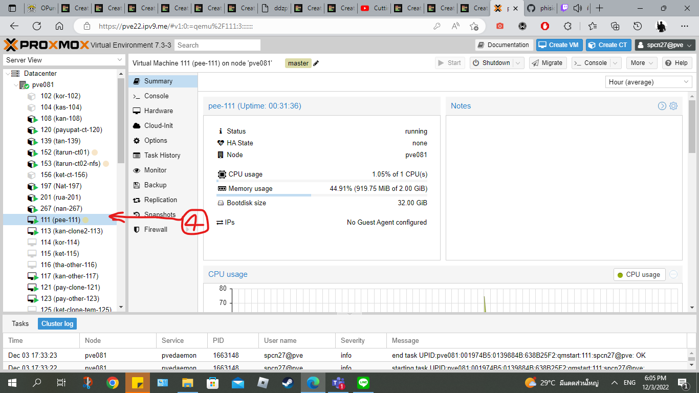
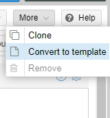
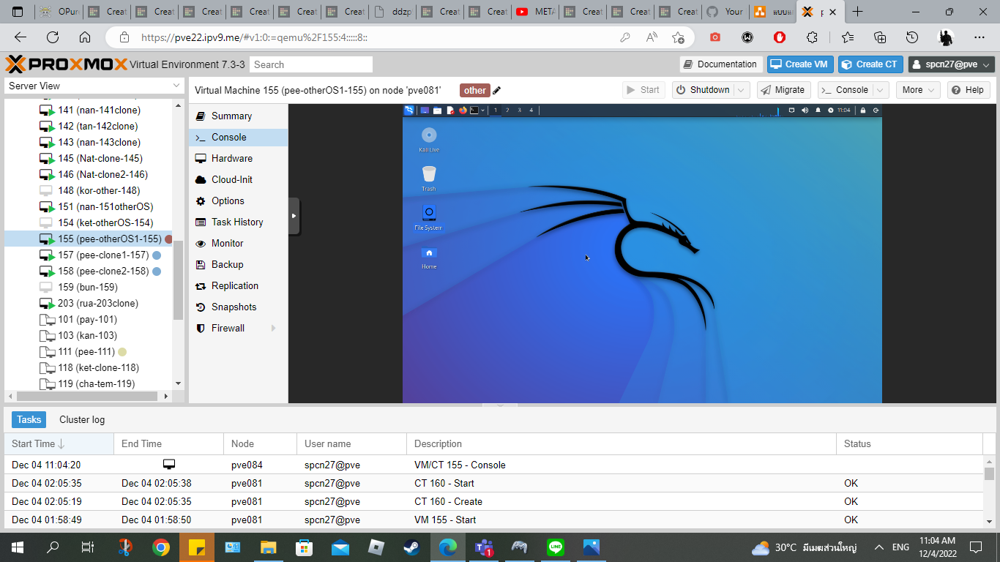
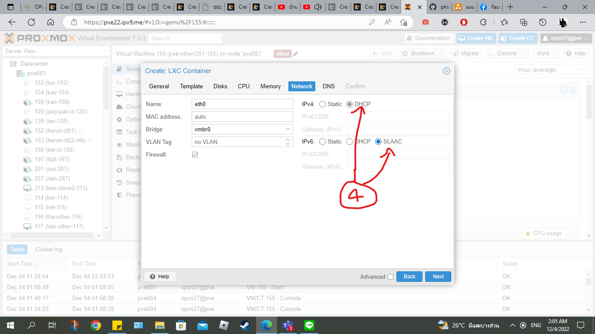

# SPCN-011
<p align="center"> </p>

# <p align="center">ขั้นตอนในการสร้าง vm and ct on Proxmox cluster บน Proxmox</p>

|<p align="center"> สารบัญ </p>|
| ------------- |
|<DL>[สร้าง master vm (ubuntu-22.04)](#สร้าง-master-vm-ubuntu-2204)<DT>[\|-แปลง vm เป็น template](#แปลง-vm-เป็น-template)<DT><DT>[ \|-clone จาก template เพื่อสร้าง vm](#clone-จาก-template-เพื่อ-สร้าง-vm)</DT></DL>|
[เปิดใช้ qemu guest agent และตั้ง localtime update ของ os](#เปิดใช้-qemu-guest-agent-และ-ตั้ง-local-time-update-ของ-os)|
|[สร้าง vm จาก os ตัวอื่นๆ](#สร้าง-vm-จาก-os-ตัวอื่นๆ)|
|[สร้าง container template (เลือกจาก CT list)](#สร้าง-container-template-เลือกจาก-ct-list)|
|[สรุป](#สรุป)|


## สร้าง master vm (ubuntu-22.04) 
-------------
[top⬆️](#spcn-011)
1. กดเลือกปุ่ม **Create VM**

<p align="center"> </p>

2. กรอกช่อง **Name** โดยตั้ง [ *ตัวอักษรชื่อภาษาอังกฤษตัวเองอย่างน้อย 3 ตัว-เลข VM ID* ] และช่องDropdown **Resource Pool** ให้เลือก [ *Special_CN* ] แล้วกด **Next**

<p align="center"></p>

3. ช่องDropdown **ISO image** ให้เลือก [ *ubuntu-22.04.1-live-server-amd64* ] แล้วกด **Next** ข้อมูลหลังจากนี้จะเป็นค่า **Default** ทั้งหมดไม่ต้องแก้อะไรทั้งสิ้นจดกว่าจะถึงการตั้งค่าใน VM

<p align="center"></p>

4. ผลที่ได้แถบขวาจะมีชื่อ VM ที่เราตั้งไว้ แล้วในหน้าหลักก็จะแสดงหน้า Status ต่างๆของตัว VM เราในแถบ **Summary** จากนั้นกด **Double Click** ที่ชื่อ VM ของเราในแถบขวา

<p align="center"> </p>

5. ก็จะเข้ามาในระบบ OS ที่เราติดตั้งไว้ทำการ Install ตามขั้นตอน และ นำเข้า SSH มาเชื่อมกับระบบโดยใช้ **Username GitHub** ของตัวเองอย่างเช่นในรูป 

<p align="center"> </p>

6. ผลที่ได้จะเข้ามาในระบบ OS เรียนบร้อย 

<p align="center"> </p>

### แปลง vm เป็น template 
[top⬆️](#spcn-011)
1. จากตัว VM ให้เลือก Dropdown **More** มุมขวาบน แล้วเลือก [ *Convert to template* ]

<p align="center"> </p>

2. ผลที่ได้ VM ที่เราสร้างจะกลายเป็นไฟล์ **template** ทันที 

<p align="center"> </p>

### clone จาก template เพื่อ สร้าง vm
[top⬆️](#spcn-011)

1. จากตัว template ให้เลือก Dropdown **More** มุมขวาบน แล้วเลือก [ *Clone* ]

<p align="center"> </p>

2. กรอกช่อง **Name** โดยตั้ง [ *ตัวอักษรชื่อภาษาอังกฤษตัวเองอย่างน้อย 3 ตัว-clone-เลข VM ID* ] และช่องDropdown **Resource Pool** ให้เลือก [ *Special_CN* ] แล้วกด **Clone** สร้างมา 2 ตัว หรือมากกว่านั้นก็ได้

<p align="center"> </p>

3. ผลที่ได้ก็จะได้ VM ตามจำนวนที่เรา clone เลย

<p align="center"> </p>
<p align="center"> </p>


## เปิดใช้ QEMU Guest Agent และ ตั้ง local time update ของ os
-------------
[top⬆️](#spcn-011)

1. **Shutdown** VM แล้วไปแถบ Option ของ VM ตัวนั้น เลือกกด **QEMU Guest Agent**

<p align="center"> </p>

2. เลือกติ๊ก Checkbox **Use QEMU Guest Agent**

<p align="center"> </p>

3. เข้ามาใน OS Login แล้วทำการใช้คำสั่งต่อไปนี้เพื่อ **local time update**
    ```
    sudo timedatectl set-timezone Asia/Bangkok
    ```
    และใช้คำสั่งนี้เพื่อตรวจสอบวันและเวลา

    ```
    date
    ```
    <p align="center"> </p>

4. ใช้คำสั่งต่อไปนี้เพื่อติดตั้ง **QEMU Guest Agent**
    ```
    sudo apt install qemu-guest-agent
    ```

5. ใช้คำสั่งนี้เพื่อเปิดการทำงาน **QEMU Guest Agent**
    ```
    sudo systemctl start qemu-guest-agent
    ```
    และใช้คำสั่งนี้เพื่อตรวจสอบสถานะการทำงานของ **QEMU Guest Agent**
    ```
    sudo systemctl status qemu-guest-agent
    ```
    <p align="center"> </p>
6. ผลที่ได้ในหน้า **Summary** จะมีเลข IPs เพิ่มมาหลังจากทำการเปิดใช้  **QEMU Guest Agent**

<p align="center"> </p>
<p align="center"> </p>

    


## สร้าง vm จาก os ตัวอื่นๆ 
-------------
[top⬆️](#spcn-011)
1. ทำตามขั้นตอน [การสร้าง master vm ubuntu 2204](#สร้าง-master-vm-ubuntu-2204) แต่ใช้ os ตัวอื่น โดยจะยกตัวอย่างเอา [  *kali-linux-2022-3-live-amd64*  ] และ ตั้งชื่อ VM [ *ตัวอักษรชื่อภาษาอังกฤษตัวเองอย่างน้อย 3 ตัว-otherOS-เลข VM ID* ]

<p align="center"> </p>

2. หลังได้ OS ให้ [เปิดใช้ QEMU Guest Agent และ ตั้ง local time update ของ os](#เปิดใช้-qemu-guest-agent-และ-ตั้ง-local-time-update-ของ-os)

3. ผลที่ได้จะได้ OS ที่มีหน้า UI และ ในหน้า **Summary** จะมีเลข IPs เพิ่มมาหลังจากทำการเปิดใช้  **QEMU Guest Agent**
<p align="center"> </p>
<p align="center"> </p>


## สร้าง container template (เลือกจาก CT list)
-------------
[top⬆️](#spcn-011)
1. กดเลือกปุ่ม **Create CT**

<p align="center"> <p>

2. กรอกช่อง **Hostname** [ *ตัวอักษรชื่อภาษาอังกฤษตัวเองอย่างน้อย 3 ตัว-เลข VM ID* ] แล้ว ช่องDropdown **Resource Pool** ให้เลือก [ *Special_CN* ] และกรอกช่อง **Password** ตามที่เรามีอยู่ในระบบ Proxmox

<p align="center"> <p>

3. นำเข้า **SSH public key** โดยการกดปุ่ม **Load SSH Key File** จากไฟล์ SSH Key จะอยู่ใน Path [  *user\ชื่อผู้ใช้\.ssh*  ] ([ต้องเปิดใช้ ssh key ก่อนถึงจะมีไฟล์ SSH Key](https://www.youtube.com/watch?v=WgZIv5HI44o&t=65s)) ไฟล์จะชื่อ [ *id_rsa.pub*  ] 

<p align="center"> <p>
<p align="center"> <p>

4. กด **Next** มาถึงหน้า **Network** ติ๊ก Radio Button ของ **IPv4** เป็น **DHCP** และ **IPv6** เป็น **SLAAC** แล้วกด **Next** จนติดตั้ง

<p align="center"> <p>

5. ผลที่ได้จะได้ os เหมือนกันแต่ติดตั้งเร็วกว่าปกติ 

<p align="center"> <p>
<p align="center"> <p>


## สรุป
-------------
[top⬆️](#spcn-011)


