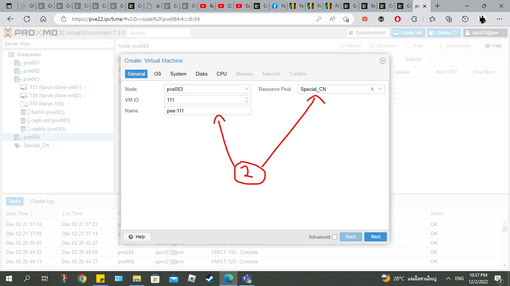

 

# 
ขั้นตอนในการสร้าง vm and ct on Proxmox cluster บน Proxmox

## สร้าง master vm (ubuntu-22.04)

1. กดเลือกปุ่ม **Create VM**

 

2. กรอกช่อง **Name** โดยตั้ง [ *ตัวอักษรชื่อภาษาอังกฤษตัวเองอย่างน้อย 3 ตัว-เลข VM ID* ] และช่องDropdown **Resource Pool** ให้เลือก [ *Special_CN* ] แล้วกด **Next**
3. ช่องDropdown **ISO image** ให้เลือก [ *ubuntu-22.04.1-live-server-amd6...* ] แล้วกด **Next** ข้อมูลหลังจากนี้จะเป็นค่า **Default** ทั้งหมดไม่ต้องแก้อะไรทั้งสิ้นจดกว่าจะถึงการตั้งค่าใน VM

        

            
        

        

            
        

